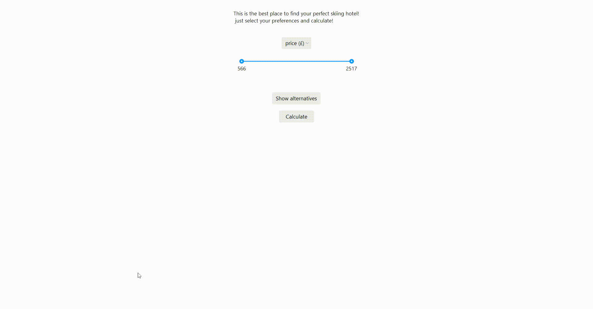

# Choosing the best skiing hotel with the TOPSIS method 🏂🏼

This is a simple desktop python application for the Decision Algorithms 2022/23 course project. 

### Short description

The application uses the TOPSIS method to compare skiing hotels. It allows the user to select their preferences based on few particular features, compares the possible options and finds the most suitable one.

The user can compare the hotels in terms of:
- price (£)
- distance from lift (m)
- altitude (m)
- total piste distance (km)
- total lifts
- total gondolas

### Installation & requirements
To run the program the user should:

- have a Python version: 3.10+ installed
- install all the packages listed in the [requirements.txt](https://github.com/mpyrek/MiAPD/blob/main/requirements.txt) file by running the following command in the terminal
    
    `pip install -r requirements.txt`
    
- run the following command
    
    `python main.py`

### Libraries used:
- numPy
- tkinter
- pandas
- csv
- Azure theme for ttk

### Usage
Firstly, the user chooses the criterion which they consider the most important and its target range. Secondly, the application 
selects 3 most favorable options. Then, the user clicks "Calculate". 

####
Here is a simple video of the app in action:

  
   

### Authors

- [Dominika Bocheńczyk](https://github.com/domkvv)
- [Monika Pyrek](https://github.com/mpyrek)

### Sources

- The sample database used - [Skiing Hotels](https://www.kaggle.com/datasets/jacklacey/skiing-hotels)
- The Azure theme files used - [Azure Theme](https://github.com/rdbende/Azure-ttk-theme)
